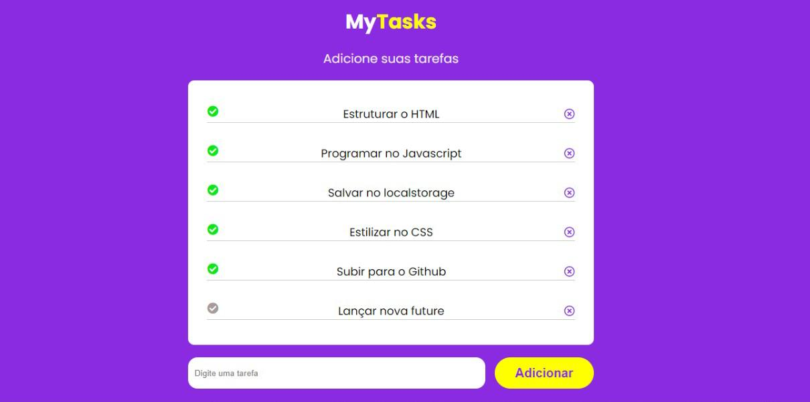
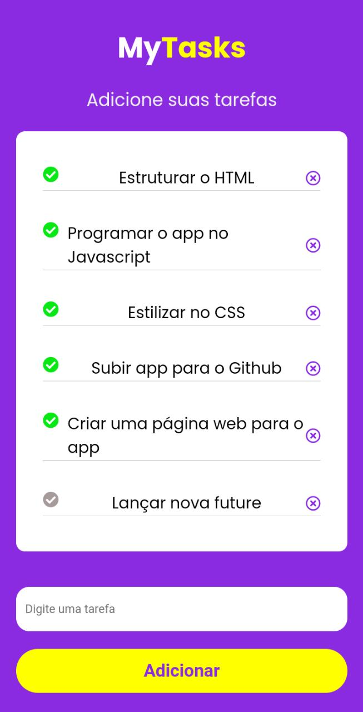

#  **`MyTasks`** :heavy_check_mark:
Organize suas tarefas de forma simples e intuitiva

**[Clique aqui](https://luigi-raynel-dev.github.io/todos_myTask/) para acessar o site do projeto**

## `DESCRIÇÃO DO PROJETO`:scroll:
Um todo list para organizar suas tarefas, traçar metas e objeivos de forma simple e intuitiva
# * 。 • ˚ ˚ ˛ ˚ ˛ • 。* 。° 。* 。 • ˚* 。 • ˚ ˚ ˛ ˚ ˛ • 。* 。° 。* 。 • ˚
### `Imagens do projeto`📷
>Desktop :computer:

 ----
>Mobile :vibration_mode:

# * 。 • ˚ ˚ ˛ ˚ ˛ • 。* 。° 。* 。 • ˚* 。 • ˚ ˚ ˛ ˚ ˛ • 。* 。° 。* 。 • ˚
### `O QUE EU APRENDI COM O PROJETO?` :thinking:
*Aprendi a utilizar o localstorage para salvar dados no navegador do usuário, elém de praticar e aperfoiçoar minha logica para com a regra de negócio fazendo que assim eu possa evoluir tanto na linguagem javascript, mas também na construção de uma aplicação.*